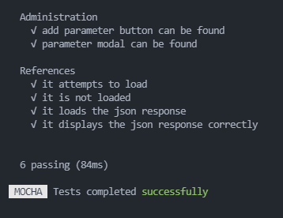
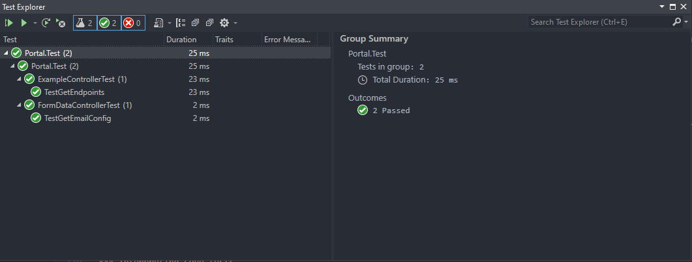

# Development Environment

## Technologies to Replicate

  

- `.NET 5 SDK v5.0.402`
- `NodeJS v14.18.0` for `npm` usage
- `Vue CLI v4.5.13`

## Required IDEs
- IDEs used for development
    - **Visual Studio 2019** - back-end development
    - **Visual Studio Code** - front-end development
- These are the IDEs used by the team, but neither are specifically required for development

## Folder structure
    .
    ├── dotnet\                         # Back-end folder for all .NET files
        ├── Portal\
            ├── Portal\
                ├── Classes\                        # Folder containing all classes in the back-end
                    ├── Area.cs                         # Class laying out an area object (area in this instance is the object that each endpoint works with)
                    ├── Endpoint.cs                     # Class laying out an API endpoint object
                    ├── MailSetting.cs                  # Class that gets and sets each form input that gets posted from the frontend
                    ├── Parameter.cs                    # Class laying out an endpoint parameter object
                ├── Controllers\                    # Folder containing all the controllers in the back-end
                    ├── ExampleController.cs            # Web API controller that contains the example API endpoint that we are displaying in the frontend
                    ├── FormDataController.cs           # Web API controller that contains logic for sending an email to a specified reciever
                ├── Services\                       # Folder containing all of the service in the back-end
                    ├── EmailService.cs                 # Service that extends the IEmailService interface that lays out the body of the email to be sent
                    ├── IEmailService.cs                # Interface that contains a task that asynchronously sends an email
                ├── ViewModels\                     # Folder containing all of the view models in the back-end
                    ├── EmailFormViewModel.cs           # View Model that contains the getters and setters for all of the elements to be sent in the email
                ├── Properties\launchSettings.json  # Json file that specifies where the back-end is running
                ├── appSettings.json                # Json file that contains the root URL for the example endpoint data and the settings for the email functionality
                ├── Portal.csproj                   # C# project containing the classes, controllers, services, models, and the launchSettings and appSettings json files
            ├── Portal.Test\                    # Folder containing all of the test classes in the back-end
                ├── ExampleControllerTest.cs        # Class of unit tests for the ExampleController.cs controller
                ├── FormDataController.cs           # Class of unit tests for the FormDataController.cs controller
                ├── testconfig.json                 # Json file that holds the information for the testing environment
                └── Portal.Test.csproj              # C# project that contains all of the test classes and the testconfig.json file
            └── Portal.sln                      # Contains information about what needs to be compiled
        └── Dockerfile                      # Dockerfile to build back-end development image
    ├── vue\                            # Front-end folder for all vue files
        ├── public\                         # Files that are served raw and accessible in its plain URL
        ├── src\                            # Source files for vue front-end
            ├── assets\                         # Asset files for the vue front-end
            ├── components\                     # HTML components to import in vue files
                ├── Navbar                          # Component that contains HTML for the navigation bar featured on App.vue
                ├── Footer                          # Component that contains HTML for the footer featured on App.vue 
            ├── repositories\                   # Folder containing repository pattern Javascript files
                ├── ExampleLocalRepository.js       # Javascript file containing the mock data for unit testing
                ├── ExampleRepository.js            # Javascript file that points to our web api object "Example" and creates a get method
                ├── FormDataRepository.js           # Javascript file that points to our web api object "FormData" and creats a post method
                ├── Repository.js                   # Javascript file that points to the url that our backend is running on
                ├── RepositoryFactory.js            # Javascript file that sets environments for either unit testing or running the project
            ├── router\                         # Folder to house the Vue router
                ├── index.js                        # JavaScript file to declare routes and paths
            ├── views\                          # Folder to house the front-end HTML pages
                ├── Administration.vue              # HTML and Javascript logic for the Administration page
                ├── Console.vue                     # HTML for the Console page
                ├── Home.vue                        # HTML for the Home page
                ├── Login.vue                       # HTML and Javascript logic for the Login page
                ├── References.vue                  # HTML and Javascript logic for the References page
            ├── App.vue                         # Main HTML template for Vue pages
            ├── main.js                         # JavaScript file for Vue, Bootstrap, etc. imports
        ├── tests\unit\                     # Test folder for vue files
            ├── Administration.spec.js          # JavaScript file containing the unit tests for Administration.vue
            ├── References.spec.js              # JavaScript file containing the unit tests for References.vue
        ├── Dockerfile                      # Dockerfile to build front-end development image
        └── package.json                    # JSON file to store vue config data and npm script aliases

    [Truncated for brevity, only relevant folders/files were highlighted.]

## Important files
**appSettings.json** - This file stores all of the configuration settings for the back-end

**launchSettings.json** - This files stores the launch configuration settings for the back-end including what port it will run on

**package.json** - This file stores all dependencies needed for the project, dependencies are stored in json format with their name and version number to be installed by `npm`

**Dockerfiles** - Dockerfiles are used to build the development images for both front and back-end; these are mostly used with the Docker repo and docker-compose, but can be built by themselves

## Replicating / Testing the Environment
### Building and running
- Clone the project repository from BitBucket
    - `git clone https://bitbucket.org/accutechdev/bsu.developer-portal/src/master/ bsu.developer-portal`
#### &emsp;Gathering required technologies:
- Download .NET 5 SDK from [dotnet.microsoft.com](https://dotnet.microsoft.com/download/dotnet/5.0)
    - Make sure to download the correct SDK for your machine (Windows, Linux, Mac)
- Download the latest LTS of Node.js from [nodejs.org](https://nodejs.org/en/download/)
    - Again, make sure to downlaod the correct installer for your machine
- After installing node, open a CLI of your choice, run the following command to install Vue CLI
    - `npm install -g @vue/cli`

#### &emsp;Database:
- Open SQL server management studio and connect to your Desktop server
- Right click on `Databases` and select `Restore Database`
- Select the radio button labeled `Device` and click the `Browse (...)` button next to the input box
- In the window that comes up, select `File` from the dropdown menu
- Select any existing paths in the `Browse Media` box and click `Remove`
- Select `Add`
- Find the project repository in the file structure that comes up, select the `Cheetah.bak` database backup file, and select `Ok`
- Select the `Cheetah.bak` file path in the `Browse Media` box and click `Ok`
- In the restore database window, write `Cheetah` in the database input box if it's not already inputed
- Click `Ok` to restore the Cheetah database from the backup file

#### &emsp;Back-end:
- In a CLI, move into the *\dotnet\Portal\Portal* folder and first build the project .dll
    - `dotnet build "Portal.csproj"`
- Then, move into the *\bin\Debug\net5.0* folder to run the .dll
    - `dotnet run Portal.dll`
- The back-end should spin up, and in a browser you can go to http://localhost:5000 and should see the back-end swagger page

#### &emsp;Front-end:
- In a CLI, move into the *\vue* folder and first install the dependencies
    - `npm install`
- Then, in the same folder, start the front-end with npm
    - `npm run serve`
- The front-end should spin up, and in a browser you can go to http://localhost:8080 and see the front-end web application pages

### Building and running with Docker
- Run the following docker-compose command in the root folder of the repository (where docker-compose.yml is):
    - `docker-compose up --build`
    - This might take some time for the initial build.
    - If Docker prompts to share folder(s), confirm them.
- If you want to rebuild from scratch, try using --nocache option.
    - `docker-compose build --no-cache`
    - Then running `docker-compose up`

***OR***

- Navigate to [The Development Portal Docker Repository](https://github.com/astafford2/Web-based-API-Simulator-Developer-Portal-Docker) and follow the documentation in the README

### Running code tests
#### &emsp;Front-end:
- In a CLI, move into the *\vue* folder and run the front-end tests
    - `npm run t`

#### &emsp;Back-end:
- In a CLI, move into the *\dotnet\Portal\Portal.Test* folder and run the back-end tests
    - `dotnet test`
- Tesing from **Visual Studio 2019** is also possible. In the IDE, right click on the Portal.Test project and select "Run Tests"

### Interpreting code tests
#### &emsp;Front-end:
- After running the command `npm run t`, if the tests pass, they will have a checkmark next to them as shown below
 

 
<ul>
    <li>"add parameter button can be found" tests if the add parameter button can be found on the parameter modal on the administration page
    <li>"parameter modal can be found" tests if the modal to add parameters can be found on the administration page
    <li>"it attempts to load" tests if the references page attempts to load information from the back-end
    <li>"it is not loaded" tests if the references page is not loaded before it gets the information from the back-end
    <li>"it loads the json response" tests if the references page can load the json data from the testing environment
    <li>"it displays the json response correctly" tests if the references page displays the json response correctly
</ul>

#### &emsp;Back-end:
- After running the command `dotnet test`, if the tests pass the test window will look like this
 

 
<ul>
    <li>The TestGetEndpoints test method tests the data configuration from the ExampleController controller
    <li>The TestGetEmailConfig test method tests the data configuraiton from the FormDataController controller
</ul>
