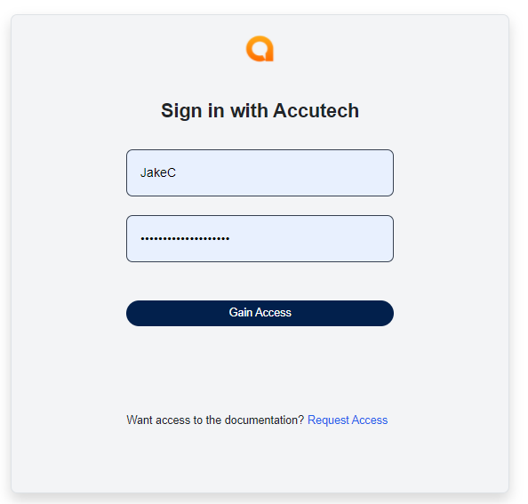
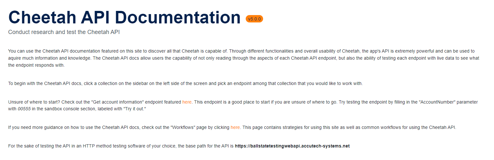

## User Documentation
---
### - Home Page

Opening the software, you will start at the home page, which provides some of the uses that will come or be in the software in the end product. On this page, you will find a login button located at the top right of the page. Click it to go to the login page. A home button will be displayed at the top of the screen at all times on every page for whenever the user wants to return to the main home page. The Home page also features the run data loading button. When the user clicks this button it will either add or update the collections, endpoints, and etc. featured in the documentation with the newest version of the Cheetah API. This is useful when the user knows that an update to the api has occured and the user needs the newest version of the documentation.

  
- After the user clicks the data loading button, a spinner will replace the button indicating that the data is being loaded in
    - After the spinner disapears and the button comes back, the data has been loaded

#### Page buttons:
- <b>Home:</b> Goes back to the starting page where you would need to go back throgh the login page
- <b>Login:</b> Brings the user to the login page where they gain access if they haven't already
- <b>Run Data Loading:</b> Allows the user to load data in from Accutech's Cheetah swagger page.

---
### - Login Page

On the login page, the user will have the option to log in or request access. Selecting the Gain Access button will make an HTTP Token call to the Cheetah API with the credentials entered in the Username and Password fields. If the username and password are legitimate, the login will go through successfully, and the user will then be taken to the next page which is the references page. If the username and password are incorrect, the Cheetah call will not go through, and the user will be shown an error to check their entered credentials.

If the user selects the Request Access button, they will be given a form to fill out that will send an email to an email address specified in the back-end. The email will contain the information gathered from the form. After filling out the form, the user can click the Submit Form button and the email will be sent. Currently, to send an email the "Enabled" option in the appSettings.json file in the back-end needs to be set to true. The email address to be sent to is currently set to our professor's email address, for grading purposes.

  
- The user can login with their Accutech username and password

#### Page buttons:
- <b>Home:</b> Goes back to the starting page
- <b>Gain Access:</b> Brings the user to the references page
- <b>Request Access:</b> Opens a modal containing a form that a user can fill out in order to request access to the API
- <b>Submit Form:</b> Submits the form and send an email to an administrator (specified in the back-end)

---
### - References Page

On the references page, the user will first be brought to the references landing page telling the user to select an object link. From there the user can select which object in the Cheetah API they would like to either work with or see the available endpoints of from the sidebar. After the user clicks one of these objects it will drop down with all of the endpoints available in that object. Once the user clicks one of these endpoints they will be brought to a page that lists information about that specific endpoint, including the endpoint's description, parameters, and responses. If the user wishes to edit the description on the endpoint to gain a better understanding of what it does, the user can click the edit button, click the endpoint description, type what they want the description to be, and click the save button. The page will reload with the new endpoint description.

  
- The References landing page looks like this. From here the user can select an object link in the sidebar on the left, and an ednpoint.

  
- Once an endpoint is selected it will bring the user to that endpoint's page with information about the endpoint's parameters and responses
    - In this case, 'GetAccountGroupInformation' was selected

  
- If a user wants to edit an endpoint's description, they cn click the edit button and start typing in endpoint description area
    - Once a user is done they can click the save button and the change will be saved

#### Page buttons:
- <b>Home:</b> Goes back to the starting page

---
### - Console Page

The console page has been set up layout-wise but does not have any functionality currently. In future versions we will be moving into giving this page funcitonality or perhaps merging the console onto the references page in the form of a card view.

#### Page buttons:
- <b>Home:</b> Goes back to the starting page

---
#### Pages Dropdown Menu (Featured on the Reference, Console, Administration pages, and home page after logging in):
- <b>References:</b> The Reference option will take you to the references landing page
- <b>Console:</b> The Console option will take you to the console page
- <b>Admin:</b> The Administration option will take you to the administration page