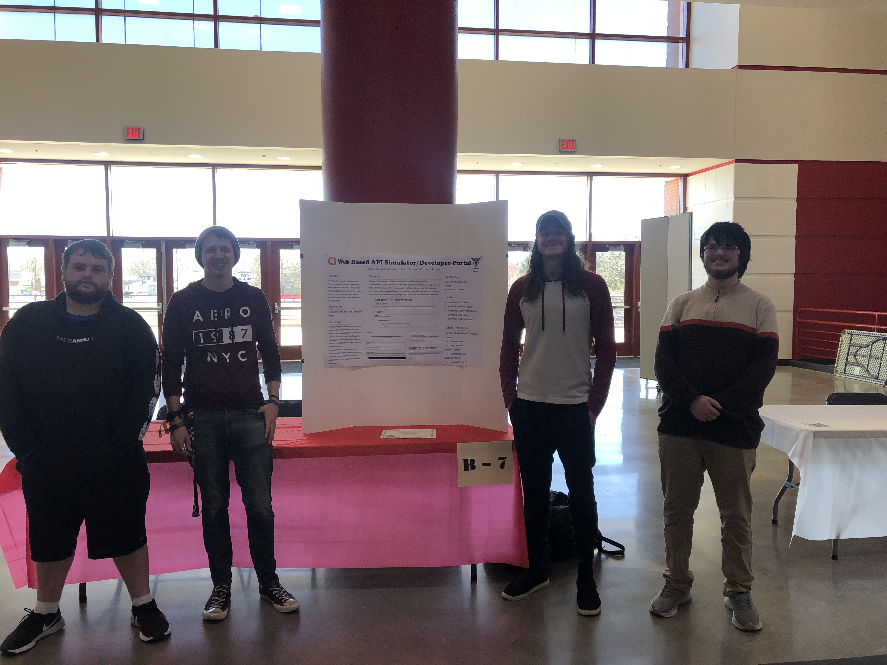
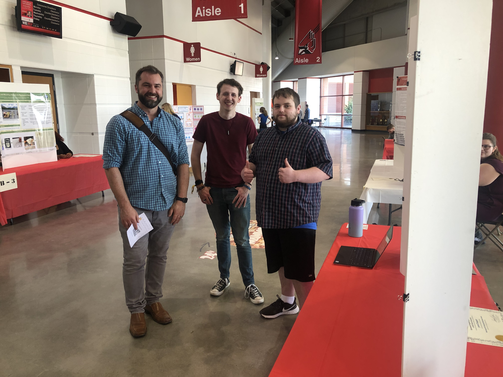
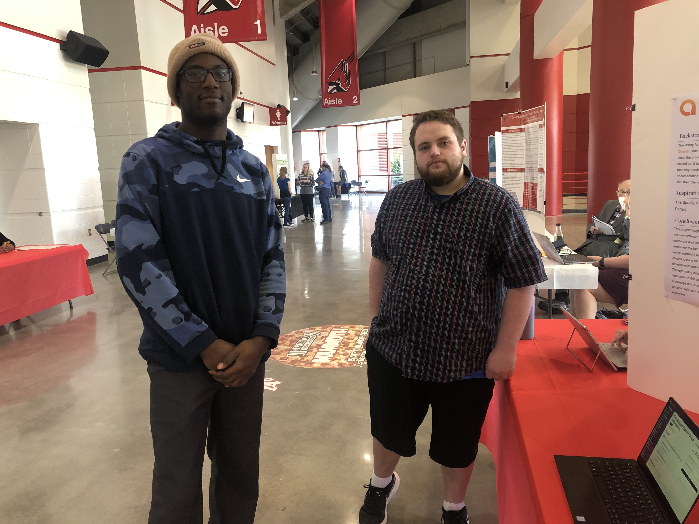
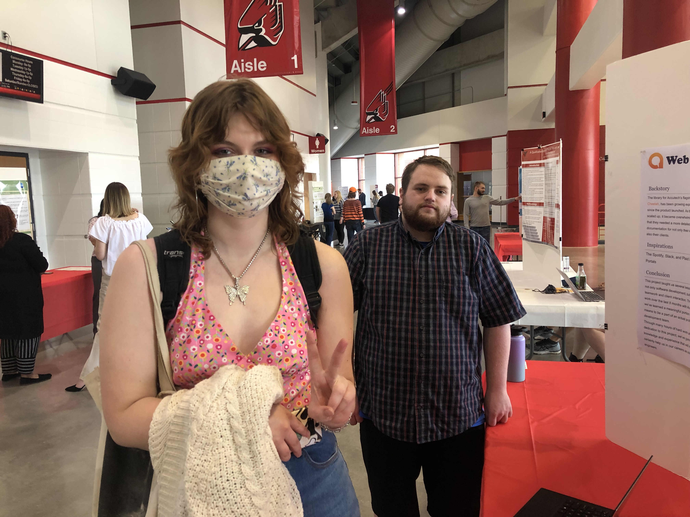
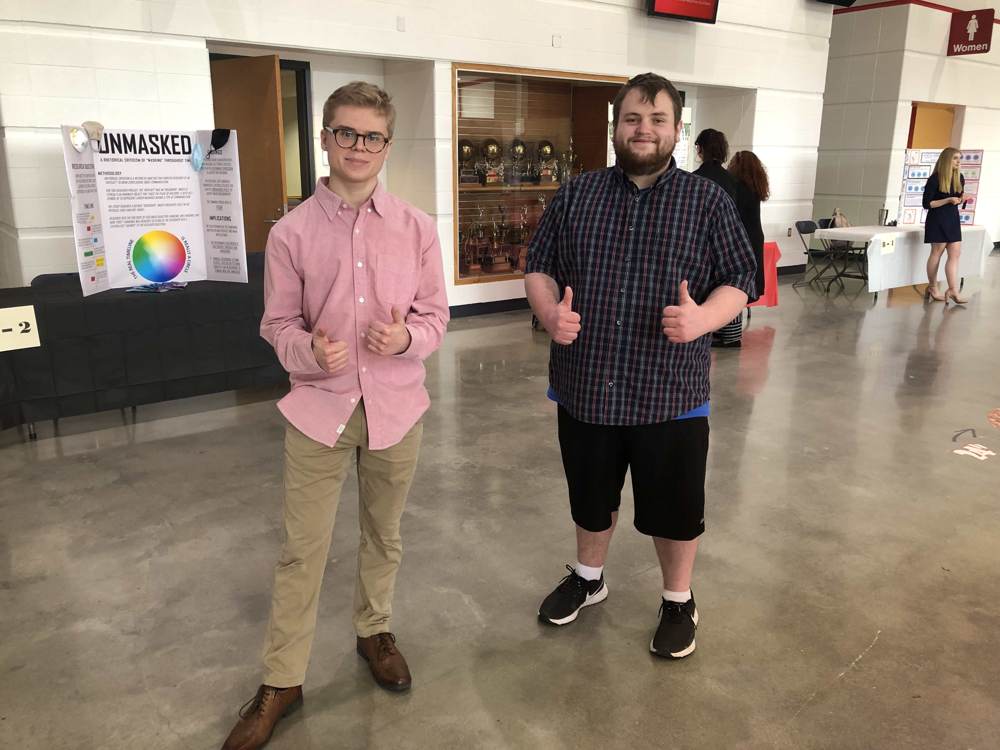
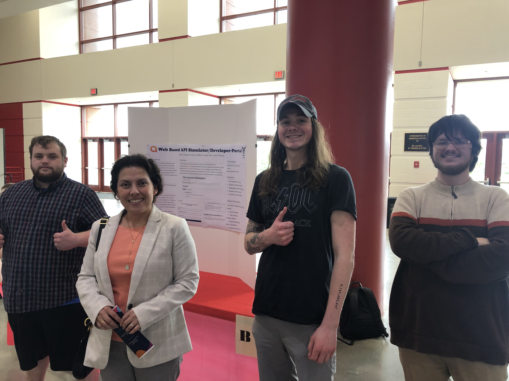

# Student Symposium

## Web-based API Simulator/Developer-Portal Team
  

## Listeners

### Adam Thatcher
 

### Brian Walker
 

### Lilly Elrod
 

### Phillip Betts
 

### Susana Rivera-Mills
  

## Team Experience
### Jake
The Student Symposium was extremely informative and allowed me several different insights into presenting a project. It allowed me an opprotunity to hone my skills of selling a project to people who have never seen it before. Though the many people we showed the project to and the different responses we received about it, I gained an understanding into how to thoroughly explain and present a new project concept to new viewers. Along with this, seeing and hearing from others at the Symposium was very informative and many of the ideas I had never even considered before. From the many different areas of study these projects came from, Chemistry, Sociology, Business, etc., I was able to learn a lot about various concepts that I didn't have much knowledge in previously.

### Jaren
I found my experience at the Student Symposium to be incredibly informative. It was interesting to see and hear about the variety of projects and posters covering intriguing topics; created by people from different majors. Presenting our project at the Student Symposium was a new experience, and I feel that I did learn something from it. At the beginning of the Student Symposium, I was a little nervous and unsure how it would turn out. In the end, presenting a project that we were proud of and spent a lot of time making, in my opinion, made the presenting process incredibly easy and quite enjoyable. Presenting our project also seemed to get easier the more we presented it. Presenting at the Student Symposium allowed me to successfully practice and advance my skill and ability to communicate and explain certain information, topics, and ideas efficiently and fluently. In general, I would say that I have progressed my overall ability to present. Overall, it felt amazing to talk about our project, the work we put into it, and how it turned out. In addition, while the Student Symposium was a great experience, it did feel a little slow as there were not as many people as I was expecting. Other than that, everything else about the student symposium seemed to go well. 

### Austin
The Student Symposium was an excellent learning experience. It gave me the chance to share our work with those outside CS498--particularly those outside the computer science field, which proved to be a bit of a challenge at some points. The art of explaining technical terms and processes to those not well-versed in it is a useful skill and I'm glad I had the opportunity to work on it. I also enjoyed seeing the works of students in other fields--it allowed me to broaden my horizons beyond computer science even if it only a little bit.

### Andrew
The Student Symposium was a great experience for explanation concepts within our realm to those who don't know much or anything about them. It was very informative on what people look for in a project from a very overall understanding and the best ways to explain concepts in a way that those without the same knowledge as me can easily understand the pieces of a development project. Seeing so many different colleges of study at the symposium was very enlightening on how many opportunities there are for all student to get experience in their field before they graduate.
